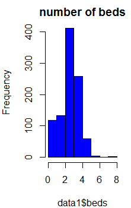
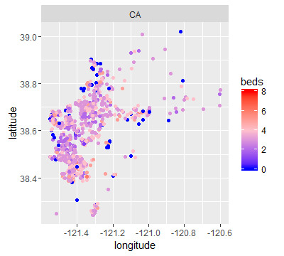
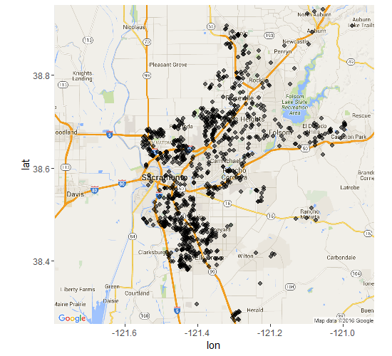

## SVC Data of Real estate transactions in California.

The Sacramento real estate transactions file is a list of 985 real estate transactions in the Sacramento area reported over a five-day period in 2008, as reported by the Sacramento Bee.

[URL to the SVC file](http://samplecsvs.s3.amazonaws.com/Sacramentorealestatetransactions.csv)

## The code 

```{r data}
require(ggplot2)
require(ggmap)
data<-read.csv(file.chose(),header = T)
names(data)
head(data)
summary(data)

```


example of the head:
```
head(data)
```
 num | street | city   | zip | state | beds | baths | sq__ft | type | sale_date | price | latitude | longitude
-----|-------|--------|-----|-------|------|-------|--------|------|-----------|-------|----------|---------- 
1 | 3526 | HIGH ST SACRAMENTO | 95838 | CA | 2 | 1 | 836 | Residential | Wed May 21 00:00:00 EDT 2008 |  59222 |  38.63191 | -121.4349
2 |  51  | OMAHA CT SACRAMENTO | 95823 | CA | 3 | 1 | 1167 | Residential | Wed May 21 00:00:00 EDT 2008 | 68212 | 38.47890 | -121.4310
3 |2796 | BRANCH ST SACRAMENTO | 95815 | CA | 2 | 1 | 796 | Residential | Wed May 21 00:00:00 EDT 2008 | 68880 | 38.61830 | -121.4438
4 | 2805 | JANETTE WAY SACRAMENTO | 95815 | CA | 2 | 1 | 852 | Residential | Wed May 21 00:00:00 EDT 2008 | 69307 | 38.61684 | -121.4391
5 | 6001 | MCMAHON DR SACRAMENTO | 95824 | CA | 2 | 1 | 797 | Residential | Wed May 21 00:00:00 EDT 2008 | 81900 | 38.51947 | -121.4358
6 | 5828 | PEPPERMILL CT SACRAMENTO | 95841 | CA | 3 | 1 | 1122 | Condo | Wed May 21 00:00:00 EDT 2008 | 89921 | 38.66260 | -121.3278


## plot #1 number of bedroom in the hose: 

```{r pressure}
hist(data1$beds,col="blue", main = "number of beds")
```



## plot #2 the number of bed roomss per erea: 

```{}
sp<-ggplot(data1, aes(x=longitude, y=latitude, color=beds)) + geom_point()
sp<- sp + facet_grid(. ~ state)
sp+scale_color_gradient2(midpoint=2, low="blue", mid="pink", high="red", space ="Lab" )

```



## plot #3 the map of California state:

```{}
map <- get_map(location = c(lon = mean(data1$longitude), lat = mean(data1$latitude)), zoom = 10,
               maptype = "roadmap", scale = 2)
ggmap(map) +
    geom_point(data = data1, aes(x = longitude, y = latitude, alpha = 2), size = 3, shape = 20) +
    guides(fill=FALSE, alpha=FALSE, size=FALSE)


```




##summerys of the research:

- most of the people prefer to by 2 bedrooms next to Sacramento city in California.

