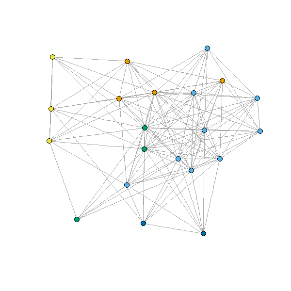
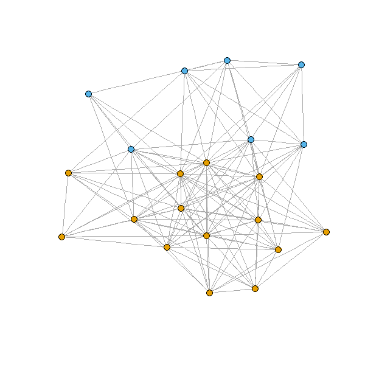

# Question 1 


```R
library(igraph)
ga.data <- read.csv('ga_edgelist.csv', header=TRUE)
g <- graph.data.frame(ga.data,directed = T)

```
### Betweenness

```R
 > betweenness(g)
 ```
 ```R
        lexi         owen        sloan       torres        derek        karev     o'malley         yang         grey        chief 
         0.0          0.0          5.5         11.0          0.0         15.5         12.0          2.0          7.0          0.0 
  ellis grey   susan grey       bailey        izzie       altman      arizona        colin      preston       kepner      addison 
         1.0          0.0          0.0         14.0          0.0          0.0          0.0          0.0          0.0          0.0 
       nancy       olivia mrs. seabury        adele  thatch grey       tucker         hank        denny         finn        steve 
         0.0          0.0          0.0          0.0          0.0          0.0          0.0          0.0          0.0          0.0 
         ben        avery 
         0.0          0.0 
    
```

```R
  > which.max(betweenness(g))
    karev 
       6 
```

## Closeness

```R
closeness(g)
```
```R

        lexi         owen        sloan       torres        derek        karev     o'malley         yang         grey        chief 
 0.001841621  0.001149425  0.001650165  0.001447178  0.001377410  0.001287001  0.001149425  0.001075269  0.001280410  0.001111111 
  ellis grey   susan grey       bailey        izzie       altman      arizona        colin      preston       kepner      addison 
 0.001040583  0.001040583  0.001075269  0.001075269  0.001008065  0.001008065  0.001008065  0.001008065  0.001008065  0.001008065 
       nancy       olivia mrs. seabury        adele  thatch grey       tucker         hank        denny         finn        steve 
 0.001008065  0.001008065  0.001008065  0.001008065  0.001008065  0.001008065  0.001008065  0.001008065  0.001008065  0.001008065 
         ben        avery 
 0.001008065  0.001008065 

```

```R
> which.max(closeness(g))
  lexi 
   1
   
```


##  Eigenvector

```R

vec <-evcent(g)
vec$vector

        lexi         owen        sloan       torres        derek        karev     o'malley         yang         grey        chief 
 0.525580626  0.067803814  0.641812107  0.717877288  0.250030245  1.000000000  0.600697535  0.023949556  0.300492721  0.000000000 
  ellis grey   susan grey       bailey        izzie       altman      arizona        colin      preston       kepner      addison 
 0.000000000  0.000000000  0.000000000  0.565395852  0.207702396  0.210120473  0.007009961  0.007009961  0.292696923  0.553736435 
       nancy       olivia mrs. seabury        adele  thatch grey       tucker         hank        denny         finn        steve 
 0.187856429  0.468519243  0.292696923  0.000000000  0.000000000  0.000000000  0.165489626  0.165489626  0.087953295  0.087953295 
         ben        avery 
 0.000000000  0.153835832 

```

```R
> which.max(vec$vector)
karev 
    6 

```


## Community Detection

### 1) Girvan-Newman community detection algorithm 
```R
g2 <- graph.data.frame(ga.data,directed = F)
fc <-edge.betweenness.community(g2)

which.max(fc$modularity)
[1] 26

memb <- membership(fc)
```

```R

> memb
        lexi         owen        sloan       torres        derek        karev     o'malley         yang         grey        chief 
           1            2            1            3            4            1            3            2            4            5 
  ellis grey   susan grey       bailey        izzie       altman      arizona        colin      preston       kepner      addison 
           5            5            6            7            2            3            2            2            1            1 
       nancy       olivia mrs. seabury        adele  thatch grey       tucker         hank        denny         finn        steve 
           1            3            1            5            5            6            7            7            4            4 
         ben        avery 
           6            1 

```

```R
plot(g2, vertex.size=5, vertex.label=NA,vertex.color=memb, asp=FALSE)
``` 


--- 


### 2) Girvan-Newman community detection algorithm 

```R
g2 <- graph.data.frame(ga.data,directed = F)
fc <-walktrap.community(g2)

fc$modularity

 [1]  0.00000000 -0.01730106  0.01081313  0.03676469  0.06487888  0.09256054  0.12024221  0.14749134  0.17387544  0.19982699  0.22837371
[12]  0.25692043  0.28460205  0.31185120  0.33910033  0.36678201  0.39489621  0.42171276  0.44939446  0.45544982  0.48226649  0.47923881
[23]  0.49567476  0.48875433  0.49394464  0.51470590  0.48269898  0.50562286  0.45804498  0.30449831  0.00000000  0.00000000


which.max(fc$modularity)
[1] 26

memb <- membership(fc)
```

```R

> memb
        lexi         owen        sloan       torres        derek        karev     o'malley         yang         grey        chief 
           1            2            1            3            4            1            3            2            4            5 
  ellis grey   susan grey       bailey        izzie       altman      arizona        colin      preston       kepner      addison 
           5            5            6            7            2            3            2            2            1            1 
       nancy       olivia mrs. seabury        adele  thatch grey       tucker         hank        denny         finn        steve 
           1            3            1            5            5            6            7            7            4            4 
         ben        avery 
           6            1 


```
```R
plot(g2, vertex.size=5, vertex.label=NA,vertex.color=memb, asp=FALSE)
```


***
<br>

# Question 2

### Using network analysis for Twitter text data

#### loading the data
```R
library("igraph")
load("termDocMatrix.rdata")
dim("termDocMatrix")
## [1]  21 154
```

#### Transform Data into an Adjacency Matrix and making it Boolean
```R
termDocMatrix <- as.matrix(termDocMatrix)
termDocMatrix[termDocMatrix>=1] <- 1
termMatrix <- termDocMatrix %*% t(termDocMatrix)
```

#### build a graph from the above matrix.
```R
# build a graph.
g <- graph.adjacency(termMatrix, weighted=T, mode = "undirected")

# Remove loops (self edges)
g <- simplify(g)

# set labels and degrees of vertices
V(g)$label <- V(g)$name
V(g)$degree <- degree(g)

```


### Betweenness

```R
 > betweenness(g)
 ```
 ```R
    analysis applications         code    computing         data     examples introduction       mining      network 
   3.9939394    4.1873737   13.6893939   22.3222222    9.5303030    0.5111111   17.2323232   20.6666667   17.8202020 
     package     parallel    positions postdoctoral            r     research       series       slides       social 
  12.0050505    7.3722222    0.2500000    0.0000000    0.0000000    8.6247475    1.6333333   22.5272727    5.6242424 
        time     tutorial        users 
   1.6333333   24.3863636    4.6151515 
```
```R
  > which.max(betweenness(g))
  tutorial 
  20  
```

## Closeness

```R
  > closeness(g)
```
```R
    analysis applications         code    computing         data     examples introduction       mining      network 
  0.01960784   0.01818182   0.02272727   0.02500000   0.02222222   0.02040816   0.02380952   0.02380952   0.02500000 
     package     parallel    positions postdoctoral            r     research       series       slides       social 
  0.02222222   0.02380952   0.01694915   0.01785714   0.01282051   0.01960784   0.02040816   0.02564103   0.02127660 
        time     tutorial        users 
  0.02040816   0.02631579   0.01886792 
```
```R
> which.max(closeness(g))
  tutorial 
  20
```


##  Eigenvector

```R
  > vec <-evcent(g)
  > vec$vector

    analysis applications         code    computing         data     examples introduction       mining      network 
   0.4298906    0.2193225    0.2091967    0.1917759    0.8970037    0.4108851    0.1360912    0.8777195    0.2563197 
     package     parallel    positions postdoctoral            r     research       series       slides       social 
   0.4317203    0.1709104    0.1088632    0.1520164    1.0000000    0.1307590    0.1987545    0.2970475    0.1735624 
        time     tutorial        users 
   0.1987545    0.3065386    0.4393775 
```
```R
> which.max(vec$vector)
  r 
  14

```
## Community Detection

### 1) Girvan-Newman community detection algorithm

```R
> fc <-walktrap.community(g)
> fc$modularity

 [1]  0.00000000 -0.06014327 -0.04842492 -0.03591667 -0.03770006 -0.03101140  0.01158262  0.01642756  0.03503252
[10]  0.03550382  0.03641814  0.05014233  0.06801395  0.08484872  0.10891508  0.11887455  0.15167311  0.13588655
[19]  0.13381657  0.14530870  0.00000000
```
```R
> which.max(fc$modularity)
[1] 17
```

```R
> memb <- membership(fc)
> memb
           analysis applications         code    computing         data     examples introduction       mining      network 
           1            3            2            5            3            2            1            3            1 
     package     parallel    positions postdoctoral            r     research       series       slides       social 
           2            5            4            4            2            4            2            2            1 
        time     tutorial        users 
           2            2            2
```

```R
> plot(g, vertex.size=5, vertex.label=NA,vertex.color=memb, asp=FALSE)
``` 




### 2) Girvan-Newman community detection algorithm 

```R
> fc1 <-edge.betweenness.community(g)

> fc1$modularity

 [1] -0.073865586 -0.073313225 -0.071650485 -0.067638797 -0.058363654 -0.051795645 -0.051886134 -0.049544726 -0.046637760
[10] -0.024288811 -0.023082289 -0.027039306 -0.028321237 -0.007018569  0.018007352  0.035829956  0.035747007  0.039903855
[19]  0.040388350  0.056864926  0.000000000


> which.max(fc1$modularity)
[1] 20

> memb1 <- membership(fc1)
```

```R

> memb1
         analysis applications         code    computing         data     examples introduction       mining      network 
           1            2            1            1            1            1            1            1            2 
     package     parallel    positions postdoctoral            r     research       series       slides       social 
           2            1            2            2            1            2            1            1            2 
        time     tutorial        users 
           1            1            1 
```
```R
> plot(g, vertex.size=5, vertex.label=NA,vertex.color=memb1, asp=FALSE)
```


