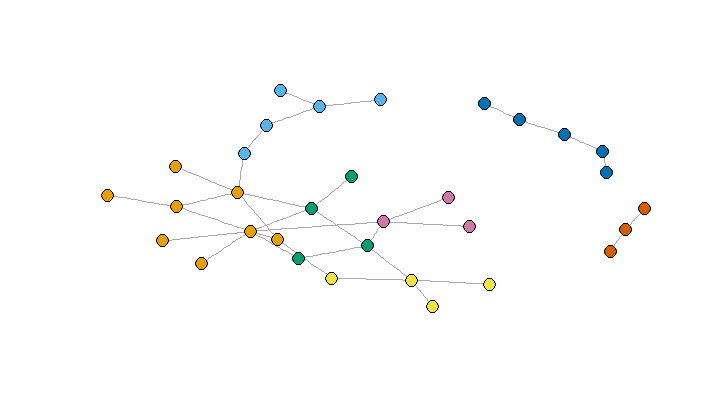
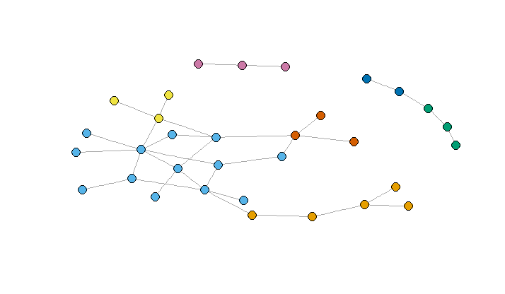

# Ex-3 Network Analysis

## Question 1 


```R
library(igraph)
ga.data <- read.csv('ga_edgelist.csv', header=TRUE)
g <- graph.data.frame(ga.data,directed = T)

```
### Betweenness

```R
 > betweenness(g)
 ```
 ```
        lexi         owen        sloan       torres        derek        karev     o'malley         yang         grey        chief 
         0.0          0.0          5.5         11.0          0.0         15.5         12.0          2.0          7.0          0.0 
  ellis grey   susan grey       bailey        izzie       altman      arizona        colin      preston       kepner      addison 
         1.0          0.0          0.0         14.0          0.0          0.0          0.0          0.0          0.0          0.0 
       nancy       olivia mrs. seabury        adele  thatch grey       tucker         hank        denny         finn        steve 
         0.0          0.0          0.0          0.0          0.0          0.0          0.0          0.0          0.0          0.0 
         ben        avery 
         0.0          0.0 
    
```

```R
  > which.max(betweenness(g))
    karev 
       6 
```

## Closeness

```R
closeness(g)
```
```R

        lexi         owen        sloan       torres        derek        karev     o'malley         yang         grey        chief 
 0.001841621  0.001149425  0.001650165  0.001447178  0.001377410  0.001287001  0.001149425  0.001075269  0.001280410  0.001111111 
  ellis grey   susan grey       bailey        izzie       altman      arizona        colin      preston       kepner      addison 
 0.001040583  0.001040583  0.001075269  0.001075269  0.001008065  0.001008065  0.001008065  0.001008065  0.001008065  0.001008065 
       nancy       olivia mrs. seabury        adele  thatch grey       tucker         hank        denny         finn        steve 
 0.001008065  0.001008065  0.001008065  0.001008065  0.001008065  0.001008065  0.001008065  0.001008065  0.001008065  0.001008065 
         ben        avery 
 0.001008065  0.001008065 

```

```R
> which.max(closeness(g))
  lexi 
   1
   
```


##  Eigenvector

```R

vec <-evcent(g)
        lexi         owen        sloan       torres        derek        karev     o'malley         yang         grey        chief 
 0.525580626  0.067803814  0.641812107  0.717877288  0.250030245  1.000000000  0.600697535  0.023949556  0.300492721  0.000000000 
  ellis grey   susan grey       bailey        izzie       altman      arizona        colin      preston       kepner      addison 
 0.000000000  0.000000000  0.000000000  0.565395852  0.207702396  0.210120473  0.007009961  0.007009961  0.292696923  0.553736435 
       nancy       olivia mrs. seabury        adele  thatch grey       tucker         hank        denny         finn        steve 
 0.187856429  0.468519243  0.292696923  0.000000000  0.000000000  0.000000000  0.165489626  0.165489626  0.087953295  0.087953295 
         ben        avery 
 0.000000000  0.153835832 

```

```R
> which.max(vec$vector)
karev 
    6 

```


## Community Detection

1# Girvan-Newman community detection algorithm

```R
g2 <- graph.data.frame(ga.data,directed = F)
fc <-edge.betweenness.community(g2)
which.max(fc$modularity)
memb <- membership(fc)
```

```R

> memb
        lexi         owen        sloan       torres        derek        karev     o'malley         yang         grey        chief 
           1            2            1            3            4            1            3            2            4            5 
  ellis grey   susan grey       bailey        izzie       altman      arizona        colin      preston       kepner      addison 
           5            5            6            7            2            3            2            2            1            1 
       nancy       olivia mrs. seabury        adele  thatch grey       tucker         hank        denny         finn        steve 
           1            3            1            5            5            6            7            7            4            4 
         ben        avery 
           6            1 


``` 




2# Girvan-Newman community detection algorithm 

```R
g2 <- graph.data.frame(ga.data,directed = F)
fc <-walktrap.community(g2)
fc$modularity
which.max(fc$modularity)
memb <- membership(fc)
```

```R

> memb
        lexi         owen        sloan       torres        derek        karev     o'malley         yang         grey        chief 
           1            2            1            3            4            1            3            2            4            5 
  ellis grey   susan grey       bailey        izzie       altman      arizona        colin      preston       kepner      addison 
           5            5            6            7            2            3            2            2            1            1 
       nancy       olivia mrs. seabury        adele  thatch grey       tucker         hank        denny         finn        steve 
           1            3            1            5            5            6            7            7            4            4 
         ben        avery 
           6            1 


```
```R
plot(g2, vertex.size=5, vertex.label=NA,vertex.color=memb, asp=FALSE)
```



